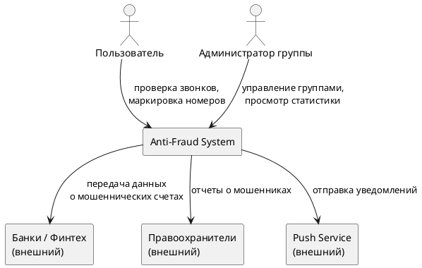
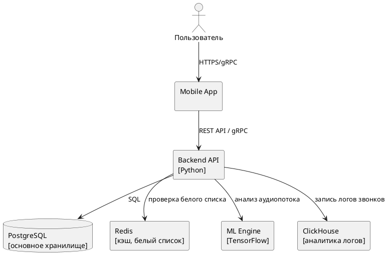

# Архитектура системы

### 1. C1 — Контекстная диаграмма
Показывает систему в окружении внешних участников и сервисов.

### 2. C2 — Контейнерная диаграмма
Раскрывает внутренние компоненты системы и их взаимодействие.

### 3. Внешние зависимости
Таблица интеграций для вашего проекта:

| Сервис | Тип интеграции | Описание |
| :--- | :--- | :--- |
| **Push Service (Firebase/APNs)** | REST (исходящий) | Отправка уведомлений об угрозах на устройства |
| **Yandex Cloud ML Services** | SDK (исходящий) | Дополнительный анализ контента и транскрибация |
| **Банковские API** | REST (исходящий) | Передача информации о счетах мошенников |
| **Правоохранительные органы** | API / Защищенный канал | Передача данных о подтвержденных мошенниках |
| **Yandex Cloud S3** | SDK (исходящий) | Хранение зашифрованных записей разговоров |
