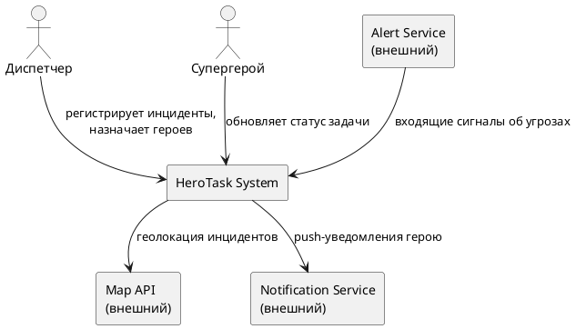
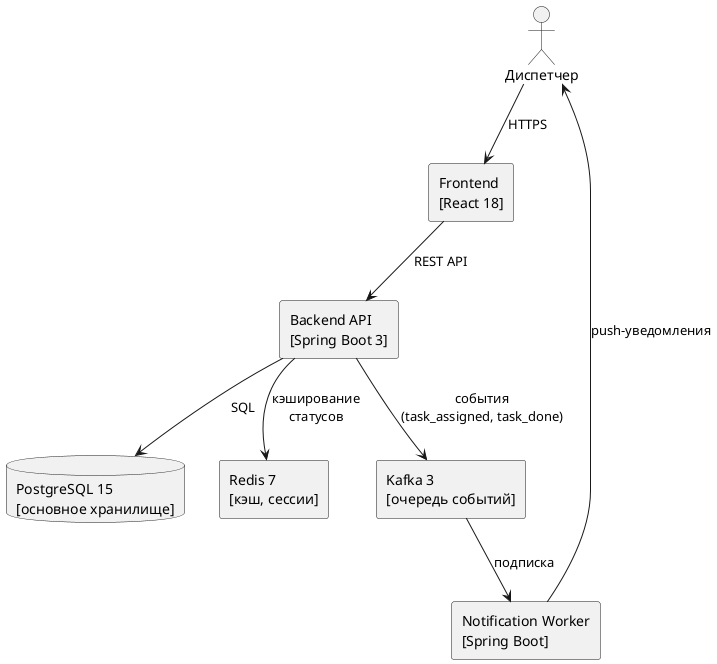

## C1 — Контекстная диаграмма

Диаграмма показывает систему HeroTask в окружении внешних участников и сервисов.

## C2 — Контейнерная диаграмма

Диаграмма раскрывает внутренние компоненты системы HeroTask и их взаимодействие.

## Внешние зависимости

| Сервис | Тип интеграции | Описание |
| ------ | -------------- | -------- |
| Alert Service | REST (входящий) | Автоматическая передача сигналов о новых угрозах |
| Map API (Yandex Maps) | REST (исходящий) | Геолокация и маршруты к инцидентам |
| Notification Service | Kafka (исходящий) | Push-уведомления на устройства супергероев |
| Yandex Cloud S3 | SDK (исходящий) | Хранение фотографий профилей героев |
