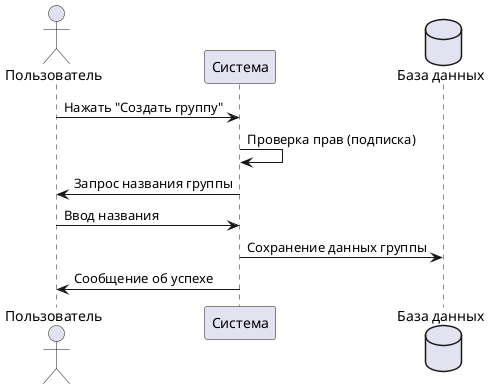

# Создание группы безопасности

## Описание
Позволяет пользователю объединить несколько аккаунтов в единый контур защиты для совместного реагирования на угрозы.

## Участники
*   **Пользователь:** Инициирует создание.
*   **Система:** Валидирует данные и создает запись в БД.

## Основной поток
1. Пользователь выбирает «Создать группу».
2. Система открывает список контактов.
3. Пользователь выбирает участников.
4. Система проверяет лимиты подписки.
5. Пользователь вводит название группы.
6. Система сохраняет данные (название, ID создателя, зашифрованные номера).

## Исключительные ситуации
*   **Пользователь не авторизован:** Перенаправление на страницу регистрации.
*   **Превышение лимита участников:** Вывод всплывающего окна с предложением расширить подписку.