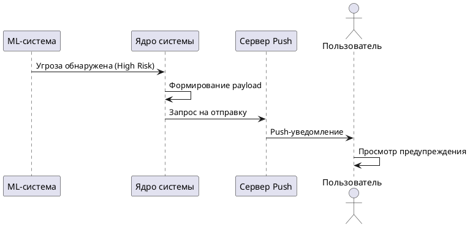

# Отправка уведомления

## Описание
Автоматическое оповещение пользователя при обнаружении системой потенциально мошеннического вызова.

## Участники
*   **Система:** Детектирует угрозу и инициирует отправку.
*   **Пользователь:** Получает уведомление на устройство.

## Основной поток
1. Система анализирует входящий вызов в реальном времени.
2. При обнаружении угрозы формируется payload с уровнем риска.
3. Запрос отправляется на сервер Push-уведомлений.
4. Уведомление отображается на экране блокировки пользователя.

## Исключительные ситуации
*   **Нет интернета:** Система активирует локальный звуковой сигнал (если есть доступ к телефонии).
*   **Уведомления отключены:** Система фиксирует статус в профиле и пропускает этап отправки.