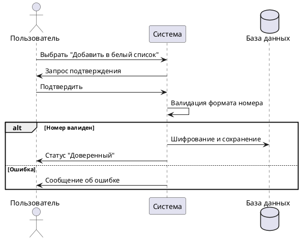

# Добавление в белый список

## Описание
Исключение доверенных номеров из процедуры анализа на предмет мошенничества.

## Участники
*   **Пользователь:** Выбирает номер для добавления.
*   **Система:** Валидирует формат и сохраняет запись.

## Основной поток
1. Пользователь выбирает номер в «Истории звонков» или «Контактах».
2. Выбирает опцию «Добавить в белый список».
3. Система запрашивает подтверждение.
4. Система шифрует номер и присваивает статус «Доверенный».

## Исключительные ситуации
*   **Номер уже в списке:** Система выводит сообщение о дубликате и завершает процесс.
*   **Неверный формат:** Система отклоняет запрос и выводит сообщение об ошибке формата.
