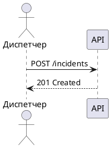

В проекте используются два инструмента для диаграмм: **PlantUML** и **draw.io**. Выбор зависит от типа диаграммы и частоты её обновления.

## Когда что использовать

| Инструмент | Лучше подходит для | Хранение |
| ---------- | ------------------ | -------- |
| **PlantUML** | Sequence, component, use case, C1/C2 | Текст прямо в `.md` файле |
| **draw.io** | ERD, сложные архитектурные схемы | Файл `.drawio` рядом с `.md` |

:::tip
Если диаграмму нужно часто менять вместе с текстом — выбирайте PlantUML: её код живёт прямо в Markdown и меняется в одном пул-реквесте.
:::

## PlantUML

Диаграмма описывается в блоке кода с языком `plantuml` прямо в Markdown-файле.

````markdown

````


**Правила:**

- Используйте кириллику в метках — диаграмма читается коллегами на русском
- Выровняйте группы `==` для крупных сценариев
- Добавляйте `alt`/`else` для альтернативных потоков

## draw.io

Диаграмма хранится в файле `.drawio` рядом с `.md`. Для отображения используется компонент `Drawio`.

```markdown title="model.md"
import Drawio from '@theme/Drawio'
import diagram from '!!raw-loader!./model.drawio';

<Drawio content={diagram} editable={false} />
```

**Правила:**

- Файл `.drawio` называется так же, как страница: `model.md` → `model.drawio`
- Параметр `editable={false}` — читатель видит диаграмму, но не может её случайно изменить в браузере
- Диаграмма должна помещаться в экран без горизонтальной прокрутки

## Правило: диаграмма + описание

Любая диаграмма должна сопровождаться текстовым описанием. Диаграмма показывает структуру, текст объясняет смысл.

```markdown
## C1 — Контекстная диаграмма

Диаграмма показывает систему HeroTask в окружении внешних участников.

[диаграмма]

Диспетчер взаимодействует с системой через веб-интерфейс...
```

:::warning
Диаграмма без подписи — это иллюстрация без подписи. Читатель не обязан угадывать, что на ней изображено.
:::
